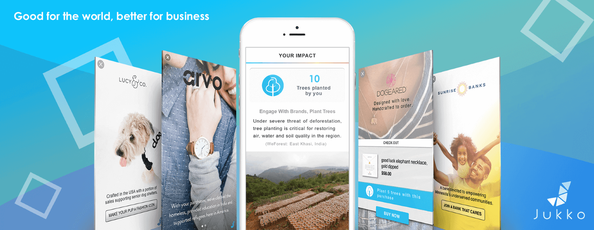

# Jukko iOS SDK Documentation



Welcome to the Jukko developer SDK documentation for iOS. Follow our step-by-step instructions to
integrate Jukko and start monetizing while converting your app into a catalyst for social
impact today!

If you have any questions during the integration process, you can reach us at [devs@jukko.com](mailto:devs@jukko.com) and we'll get back to you ASAP. Thanks for joining our movement to create a better world and a better way of doing business.

## Integration - CocoaPods

Add our latest pod to your project's `Podfile`:

```podspec
pod 'JukkoSDK'
```

## Importing

Import to access public API.

### Swift

```swift
import JukkoSdk
```

### Objective-C

```obj-c
@import JukkoSdk;
```

## Requirements

Jukko SDK support devices starting with iOS 10.0.

## Initialization

Initialization has to be done before the Jukko SDK can be customized and launched. The method will need an API key. The API key can be generated in the dashboard after registration.
You can register on [Jukko dashboard](https://dashboard.jukko.com).

After registering, you are ready to `initialize()` with API key:

### Swift

```swift
JukkoSdk.shared.initialize(apiKey: "API_KEY") { result in ... };
```

### Objective-C

```obj-c
[JukkoSdk.shared initializeWithApiKey:@"API_KEY" completion: nil];
```

Completion is optional, returns operation result:

```swift
enum OperationResult
{
    case success
    case failure
}
```

## SetUserInfo

You can provide Jukko with information about user's age group and gender. It will allow us to show more suited ads to the user.

### Swift

```swift
JukkoSdk.shared.setUserInfo(age: age, gender: gender) { result in
    result
        .ifSuccess {
            // Handle success result here
    }
        .ifFailure {
            // Handle failure result here
    }
}
```

```obj-c
[JukkoSdk.shared setUserInfoWithAge:AgeAge_13_17 gender:GenderFemale completion:^(OperationResult result) {
    switch (result)
    {
    case OperationResultSuccess:
        // Handle success result here
        break;

    case OperationResultFailure:
        // Handle failure result here
        break;
    }
}];
```

Age could take following values:

* `age_13_17`: Age from 13 to 17
* `age_18_29`: Age from 18 to 29
* `age_30_44`:  Age from 30 to 44
* `age_45_plus`: Age 45+
* `none`: Age unspecified

Gender could take following values:

* `male`
* `female`
* `none`

## Showing an ad

Next, you can show an ad by calling `showAd()` method:

### Swift

```swift
JukkoSdk.shared.showAd(){ event in
    // Handle event here
}
```

### Objective-C

```obj-c
[JukkoSdk.shared showAdWithCompletion:^(ShowAdResult * event){
    // Handle event here
}];
```

### Technical notes

1. Completion block of `showAd` function will be executed every time when you call `showAd` function, even when called during another `showAd` call or facing a frequency limit.

2. SDK's ViewController is presented on custom window.

### ShowAdResult

When ads presentation is finished, completion block will be executed on caller's thread. It will contain `ShowAdResult` object with the following information:

1. `reason`: reason why ad was closed. Possible variants are:
    * `closedByUser`: Ad view was closed by user interactions.
    * `timeout`: Api servers were unresponsive.
    * `frequencyCapping`: `showAd()` called before frequency capping timeout ended.
    * `error`: Unspecified error. Look at the `message` field for description.
    * `networkConnectivity`: Network connectivity problems.
2. `message`: String containing an extended description of reason.
3. `events`: List of events that happened with ad activity. May be null. Each event contains:

    * `timestamp` of the event (uses current timezone).
    * `adEvent` type of event. Possible variants:
        * `launch`: Ad activity opened.
        * `adShown`: Ad was shown to user.
        * `adUrlOpened`: user clicked on url, that opened in external browser.
        * `close`: Ad activity closed.

## Initialization status

Call `isInitialized` to determine if SDK is initialized.

### Swift

```swift
let initialized = JukkoSdk.shared.isInitialized
```

### Objective-C

```obj-c
Bool initialized = JukkoSdk.shared.isInitialized;
```

## Frequency capping

The Jukko SDK allows a developer to set frequency capping for ads. It counts the time since the last time when an ad was closed and ignores `showAd()` calls until frequency capping period ends. Frequency capping can be changed using:

### Swift & Objective-C

```swift
JukkoSdk.shared.adsFrequency = timeInSeconds;
```

Default value is 0.

## Console logging

By default, Jukko SDK logs only important messages, such as unrecoverable error reasons.

You can enable debug logging by calling:

### Swift & Objective-C

```swift
JukkoSdk.shared.debugMode = true;
```

Log messages will contain `Jukko SDK` tag.
